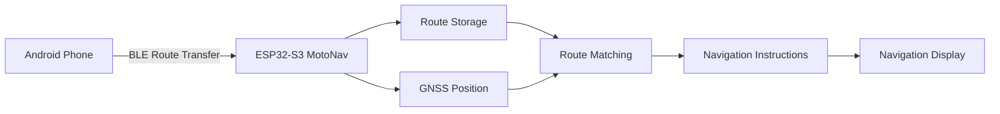
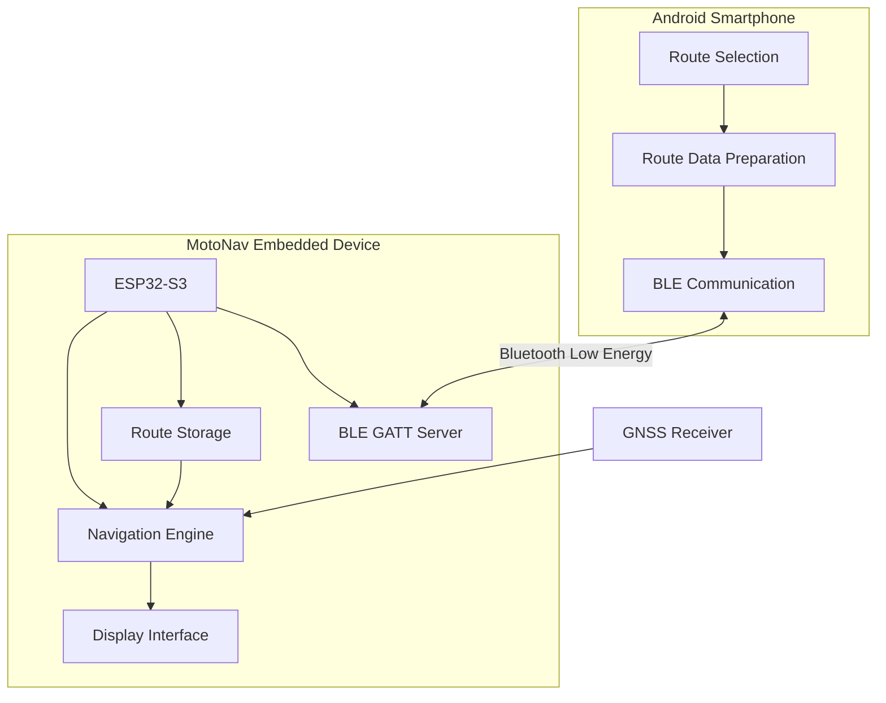
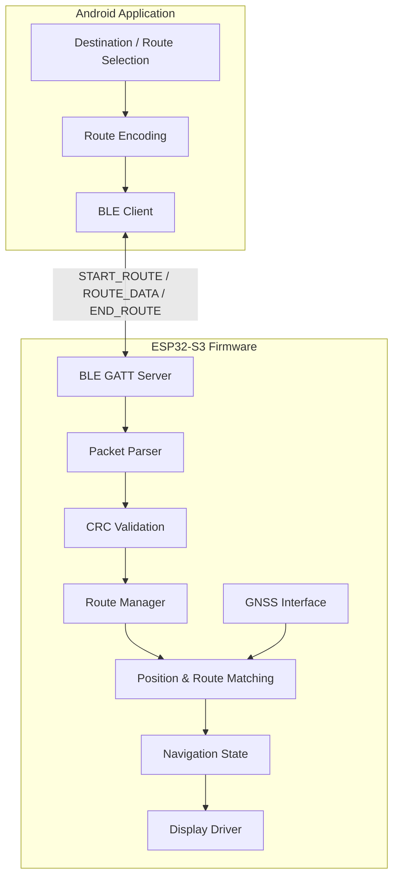
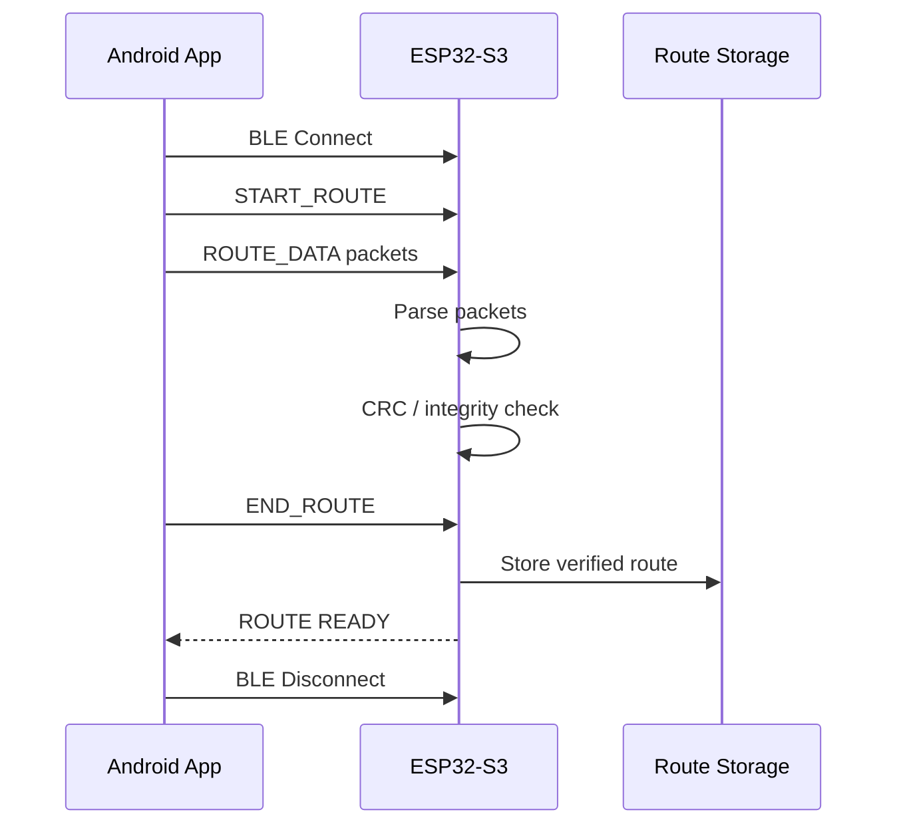
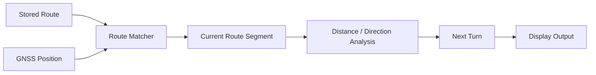
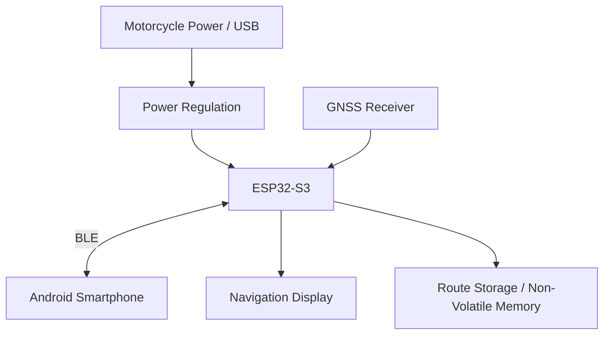

# MotoNav

**MotoNav** is a dedicated motorcycle navigation system that transfers a planned route from an Android smartphone to an ESP32-S3 embedded device, then uses the device's own GNSS for local position tracking and navigation.

The system is designed around a simple workflow:



## System Architecture



## Software Architecture



## Route Transfer Flow



## Navigation Data Flow



## Hardware Architecture



## Key Communication Protocol

MotoNav uses a packet-based BLE route transfer protocol.

```text
START_ROUTE
    ↓
ROUTE_DATA
    ├── Packet 1
    ├── Packet 2
    ├── Packet 3
    └── ...
    ↓
END_ROUTE
    ↓
CRC Verification
    ↓
ROUTE READY
```

After the route is successfully stored, the smartphone can disconnect. The embedded device then continues navigation using its onboard GNSS and the stored route.

## Repository Structure

```text
MotoNav/
├── app/                  # Android application
├── firmware/             # ESP32-S3 firmware
├── README.md
├── build.gradle.kts
├── settings.gradle.kts
└── ...
```

## Technology Stack

```text
Mobile        : Android
MCU           : ESP32-S3
Connectivity  : Bluetooth Low Energy (BLE)
Firmware      : ESP-IDF
Positioning   : GNSS
Display       : Dedicated navigation display
Protocol      : Custom BLE GATT packet protocol
```

## Development Status

MotoNav is an embedded navigation prototype under active development.

The current implementation includes the Android-side route transfer concept, ESP32-S3 BLE communication, packet-based route transfer, route integrity verification, and local route storage. GNSS-based navigation, route matching, and final display integration are part of the ongoing development.

---

**MotoNav — Smartphone-assisted route transfer, embedded navigation.**
